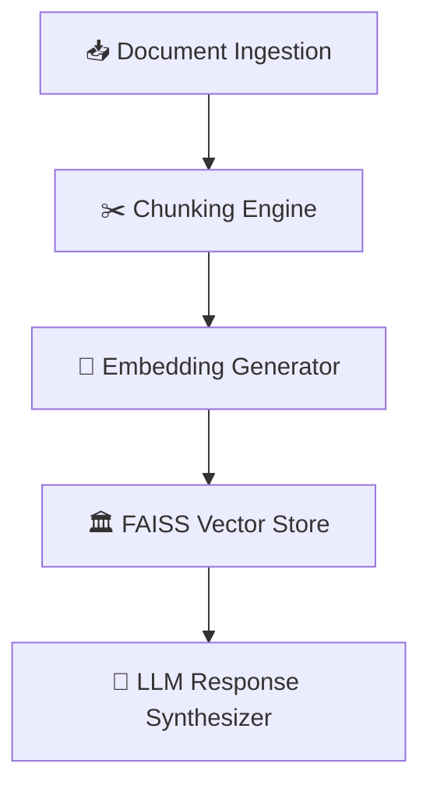

# ⚖️✨ Legal Document Analyzer 
*Your AI-Powered Legal Document Companion*  
*"Because no one should bill hours for reading boilerplate"*  

<div align="center">
  
[](LICENSE)
[](https://python.org)
[](https://arxiv.org/abs/2005.11401)

</div>

# 🎨 Visual Feature Map

# 🛠️ Tech Stack

### Core Components
- **Language**: Python 3.10+
- **LLM Framework**: LangChain
- **Vector Database**: FAISS (local) / Pinecone (cloud)
- **Embeddings**: OpenAI `text-embedding-3-small`

### Document Processing
- **PDF**: PyPDF2
- **Office Docs**: python-docx
- **Text Extraction**: Unstructured.io

### Infrastructure
- **Package Management**: Poetry
- **Environment**: virtualenv
- **API**: FastAPI (optional)

# 🚀 Launch It Like a Rocket
```bash
# 1. Clone with git
git clone https://github.com/yourusername/LegalDocGenie.git && cd LegalDocGenie

# 2. Install magic spells
pip install -r requirements.txt

# 3. Configure your wand (API keys)
echo "OPENAI_API_KEY=your_key_here" > .env && echo "Done! ✨"
```
# 💡 Try These Sample Queries
```text
1. 🔍 "Show all termination clauses in this contract"
2. 📑 "Compare indemnification sections across these 5 agreements"
3. ⚖️ "Explain this arbitration clause in plain English"
```
# 📂 Project Anatomy
```
legal-ai-assistant/
├── 📁 core/
│   ├── agent.py       # AI reasoning engine
│   └── retriever.py   # Hybrid search system
├── 📁 web/            # Future Streamlit UI
├── tests/             # pytest suite
└── models/            # Custom fine-tuned models (optional)
```
# Why This Stands Out
```diff
! Not Just Another RAG App:
+ Legal-specific text splitting (preserves clause boundaries)
+ Pre-loaded prompt templates for 50+ common legal queries
+ Redaction detection beta
! Built by lawyers-turned-coders
```


# 📜 Full Feature List
### Document Types: PDF, DOCX, TXT (images coming soon!)

### Query Types: Clause extraction, comparison, summarization

### Output Formats: JSON, Markdown, Plaintext
---

# Made with ❤️ and Python
